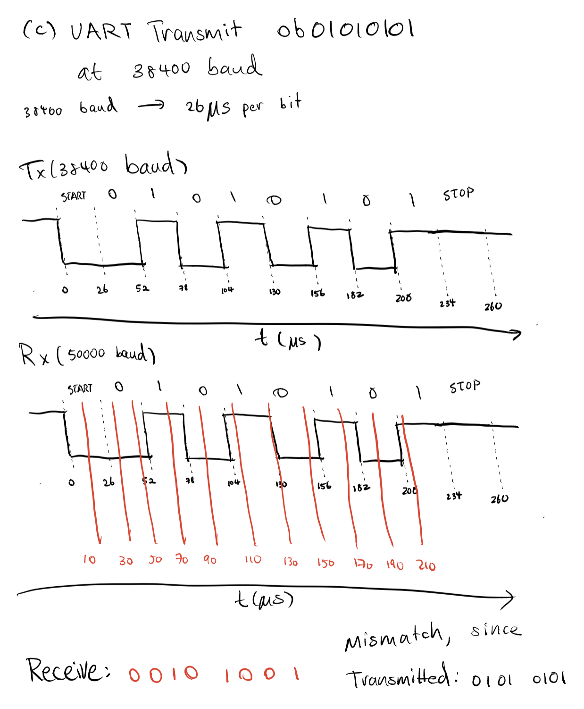
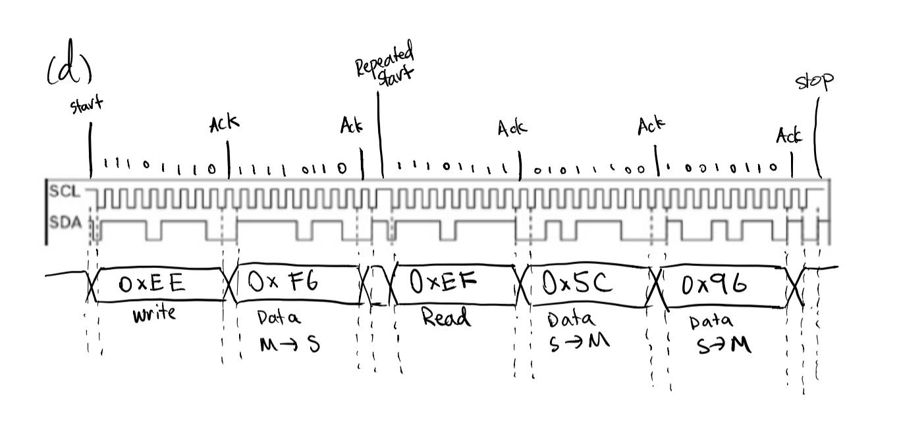

# Embedded Quiz 2
David Hou

## 1.
``` c
// 1Mhz Clock
// Centigrade Temperature: (Vin - 500) / 10

// a.
/*
Circuit Diagram Here. Allow enough text columns forproper display

                            +----------------+
    +-----------------+     |                |     330 ohm
    |                 |     |         10(PB5)|------/\/\/-----------
    |      TMP36      |     |                |               | LED  )
    |Vin    Vout   GND|     |             GND|----------------------
    +-----------------+     |                |
      |      |      |       |                |
      |      |      |       |                |
      |      |      |       |      328P      |
      |      |      |       |                |
      |      |      |       |                |
      |      |      +-------|GND             |
      |      |              |                |
      |      +--------------|A5              |
      |                     |                |
      +---------------------|3v3             |
                            |                |
                            +----------------+
*/

// b, c, d
void setup(){

    //// ADC SETUP ////

    // ADCSRA = 1010 0100
    // Enable ADC, Start Conversion, Auto Trigger. Prescaler set to 16.
    ADCSRA = 0xA4;
    // ADCSRB = 0000 0000
    // Set ADC to free running mode.
    ADCSRB = 0x00;
    // ADMUX = 0100 0101
    // Vcc reference voltage, right adjusted data, channel ADC5 (pin A5).
    ADMUX = 0x45;

    //// Timer Setup ////
    /*
    Frequency: 2Hz ~ 0Hz

    Must use 16-bit timer to achieve 2Hz Async clock from 1MHz Clock.
    Timer 1 is used, with 256 prescaler. New Freq: 3906.25

    Top of Timer: OCR1A
    Compare Register: OCR1B

    OCR1A: 0 ~ 1953
    OCR2A: 0 ~ 976
    */

    // TCCR1A = 1010 0011
    // Set to Fast PWM mode.
    TCCR1A = 0xA3;
    // TCCR2A = 0001 1100
    // Set Top of counter to OCR1A and set clock to 256 prescaler.
    TCCR1B = 0x1C;
    // Set Default OCR1A and OCR1B
    OCR1A = 1963;
    OCR1B = 976;

    // Output for LED should be on OC1B (PB2, Pin 10).
    DDRB |= (1<<2);
    //Setup Done. Begin Conversion.
    ADCSRA |= (1<<6);
}

void loop(){

    // Read Sensor Voltage from ADC result.
    // Reference voltage is 3.3V, 3300mV.
    int inpmV = (3300 / 1023) * ADCW;
    int temp = (inpmV - 500) / 10;

    if(temp <= 0){
        // 2Hz Output on OCR1B
        OCR1A = 1963;
        OCR1B = 976;
    }else if(temp >= 50){
        // 0Hz Output on OCR1B
        OCR1A = 0;
        OCR1B = 0;
    }else{
        // Blinking Output on OCR1B
        int curPercent = temp / 50;
        OCR1A = 1963 * curPercent;
        OCR1B = 976 * curPercent;
    }
}

```
    

## 2.
``` c
// Let Two buttons be on pin 2(PD2) and 3(PD3), internal pull-up, and connected to ground.
// pin 2 (INT0) is Start/Stop, pin 3 (INT1) is Reset.

int msElapsed;
bool isOn;

void setup(){
    // Set PORT D to Input with Pull-Up.
    DDRD = 0x00;
    PORTD = 0xFF;

    // Setup for External Interrupts INT0 and INT1

    // EICRA = 0000 1010
    // Interrupt INT0 and INT1 at falling edge.
    EICRA = 0x0A;
    EIMSK = 0x03;

    sei();

    // Intialize Serial and Begin
    msElapsed = 0;
    Serial.begin(9600);
    Serial.println("Stopwatch Begin.");
}


void loop(){
    delay(1);
    if(isOn){
        msElapsed += 1;
    }
}


ISR(PCINT0_vect){
// Start/Stop button on press
    cli()

    if(isOn){
        isOn = false;
        Serial.println("Paused.\nTime Elapsed: " + msElapsed + "ms\n");
    }else{
        isOn = true;
    }

    sei();
}

ISR(PCINT1_vect){
// Reset button on press
    cli();

    isOn = false;

    Serial.println("RESET!\nTime Elapsed: " + msElapsed + "ms\n");
    msElapsed = 0;

    sei();
}
```

## 3.

``` c
//a.
/*
Given 8 data bits, no parity bit, and 1 stop bit, each byte of data sends 10 bits.

|_____________|______________________________________|________|
 9   Start    8                 DATA                 1  STOP  0

So, given 38400 baud, or 38400 bits transmitted each second:

    1 sec
  ----------  * 10 bits = 0.00026s per byte transmitted, or 260ns
  38400 bits
*/

//b.
void sendByte*(uint8_t x) {

    // Block until UDRE0 is 1
    while(!(UCSR0A & 0x20));
    // UDRE1 is 1. Buffer is empty and ready to be written.
    UCR0 = x;

}

// Use Interrupts for non-blocking transmission
// Using USART_UDRE interrupt vector

//Setup:
void setup(){
    //All other settings are kept the same.
    //Ensure interrupts are enabled
    UCSR0B |= (1<<5);
    sei();
}

ISR(USART_UDRE_vect){
    cli();
    // UDRE interrupt. Buffer is empty and ready to be written.
    UCR0 = x;
    sei();
}
```
## c.


## d.
