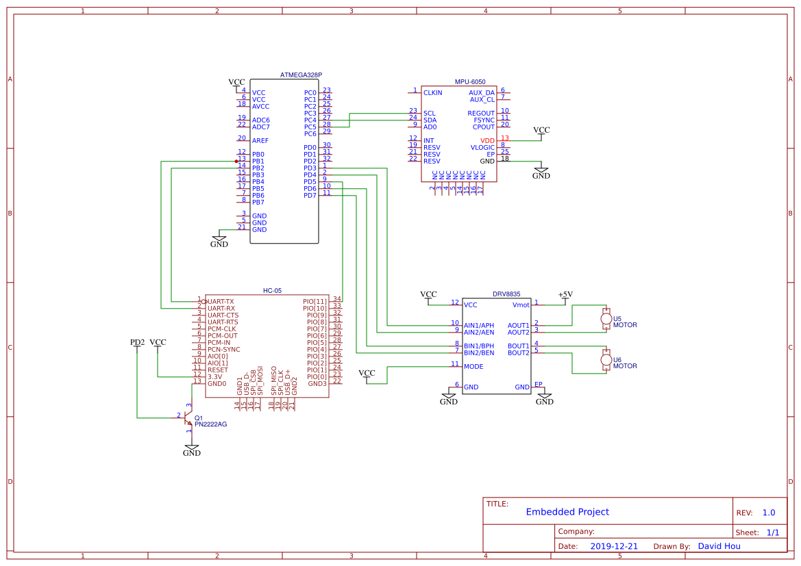

# **Embedded Project Writeup**
David Hou, Nomin Badam<br/>
Daniel Hunte, Kyle Smith<br/>
Samir Ashraf, Nicola Ramdass<br/>
Ariane Schoenwiesner, Jonathan Wiener<br/>

## Additional Parts List
- MPU6050 Motion Processing Unit
- PN2222A BJT

## Electronics


An MPU 6050 is used for keeping track of orientation, while a 2N222 NPN transistor is used to control the HC05. Since the EN pin (PIO11) level is only checked on startup for entering AT or COMM mode, the transistor allows us to digitally restart the HC05 and switch between AT and COMM mode freely. More on this below in the "Tagging" section.

<br/><br/><br/><br/>

## Navigation
The gyro in the MPU6050 is used to keep track of rotation. No multithreading is used, but the gyro is queried regularly whenever movement is expected. 

(STATE 0) From the origin point, an asterisk-like pattern (*) with six spokes is used, with the corresponding rotation and RSSI sensitivity compared to the previous best. In effect, we want a radar-like sweep that provides an angle that best represents the direction of the next vehicle or beacon. The spokes are each about 0.5m, and an 8-point average is used when taking the RSSI at the end of the spoke--this is relatively reliable in overcoming the ambient noise from the RSSI reading. the 60 degree arcs still leave a lot to be desired in terms of angular resolution, yet the compromise was made in the iterest of time, so that the search can be completed reasonable quickly.

``` c
case 0:
      digitalWrite(13, LOW);
      Serial.println("Start State 0");
      // Star Pattern Seeking
      
      mpu6050.update();

      for (int i = 0; i < 330; i += 55) {
        mpu6050.update();
        //Serial.println(mpu6050.getGyroAngleX() - i);
        while (abs(mpu6050.getGyroAngleX() - i) > 10){
          // Turn to next seek angle
          mpu6050.update();
          Serial.println(mpu6050.getGyroAngleX());
          if (abs(mpu6050.getGyroAngleX()) > i) {
            //Serial.println("right turn");
            RunMotors(1,0,50,50);
          } else {
            //Serial.println("left turn");
            RunMotors(0,1,50,50);
          }
        }
        // Desired seek angle reached. Move Foward.
        Serial.println("Seek Angle Reached. Foward.");
        delay(300);
        RunMotors(0,0,130,130);
        nonBlockingDelay(2300);
        RunMotors(0,0,0,0);

        Serial.println("Getting Average...");
        long curRSSI = getAverageRSSI();
        
        if(curRSSI > tagThreshold){
          Tag();
          return;
        }
        if(curRSSI > maxRSSI){ 
          digitalWrite(13, HIGH);         
          Serial.println("New Best Seek!");
          Serial.println(curRSSI);
          Serial.println(maxRSSI);
          maxRSSI = curRSSI;
          maxGyro = mpu6050.getGyroAngleX();
          nonBlockingDelay(800);
          digitalWrite(13, LOW);
        }

        Serial.println("Average Collected. Move Back.");
        RunMotors(1,1,130,130);
        nonBlockingDelay(2200);
        RunMotors(0,0,0,0);
        nonBlockingDelay(500);
      }
      
      RunMotors(0,0,0,0);
      state = 1;
      break;
```

(STATE 1) Once the full revolution has been completed, the vehicle turns to face the optimal angle using the gyro. From there, the vehicle moves foward twice, covering about 1m in the desired direction. It stops along the way a few times to again get the RSSI. If it is close enough, it will tag the next car. Otherwise, it goes back to the (*) seek phase and reclabirates the optimal direction. 

``` c
    case 1:
      // Seek complete. Turn to best angle
      Serial.println("Start State 1");

      // Turn to desired angle
      while (abs(mpu6050.getGyroAngleX() - maxGyro) > 3){
        mpu6050.update();
        if (abs(mpu6050.getGyroAngleX()) > maxGyro) {
          //Serial.println("right turn");
          RunMotors(1,0,50,50);
        } else {
          //Serial.println("left turn");
          RunMotors(0,1,50,50);
        }
      }

      for(int i=0; i<2; i++){  
        RunMotors(0,0,130,130);
        nonBlockingDelay(2000);
        RunMotors(0,0,0,0);
  
        unsigned long curRSSI = getAverageRSSI();
        if(curRSSI >= tagThreshold){
          Tag();
          return;
        }
      }
      
      state = 0;
      break;
```

## Tagging
The vehicle that is currently moving has its HC-05 module set to Master AT mode, while the rest of the vehicles are in slave mode and COMM mode, so that they can be discoverable to the master. The RSSI search filters by the CLASS of the bluetooth device, with each set to a constant that is pre-shared with the car that needs to tag with it. The function for getting RSSI uses this knowledge to only consider the RSSI of the target vehicle.

``` c
long getAverageRSSI(){
  // Get 8 point average RSSI from BT device with target class.
  int sPoints = 9;
  
  String currentClass;
  int curInd = 0;
  long signalStr = 0;
  int gotValues = 0;

  bool done = false;
  
  // Setup INQM and begin INQ.
  btSerial.write("AT+INIT\r\n");
  delay(300);
  while(!parseSerial()){}
  serialLineBuffer = "";
  btSerial.write("AT+INQM=1,2,3\r\n");
  delay(300);
  while(!parseSerial()){}
  serialLineBuffer = "";
  btSerial.write("AT+INQM=1,50,20\r\n");
  delay(300);
  while(!parseSerial()){}
  serialLineBuffer = "";
  btSerial.write("AT+INQ\r\n");
  
  // Flush Line Buffer
  serialLineBuffer = "";
  serialRLineBuffer = "";
  Serial.flush();
  btSerial.flush();
  delay(800);
  

  // Start Capturing Values from INQ reults.
  while(!done){
    lineBufferAvailable = parseSerial();
    currentClass = "";
  
    if(lineBufferAvailable){
      // Got a full line from serial buffer.
      Serial.println("= = Serial Line = =");
      
      if(serialLineBuffer.length() >= 24){
        // INQ response line found. 
        // Get CLASS value from current INQ message.
        
        for(int i=serialLineBuffer.length()-11; i < serialLineBuffer.length() - 5; i++){
          currentClass = currentClass + serialLineBuffer[i];
          curInd++;
        }
      
        if(currentClass == targetClass){
          Serial.println(":) Class Matching RSSI!");
          signalStr += getRSSI(serialLineBuffer);
          Serial.println(signalStr);
          gotValues += 1;
        }else{
          Serial.println("/!\\ Non-Matching RSSI.");
          Serial.println(currentClass);
        }
      }else{
        // Not INQ response line.
        char fT[2];
        fT[0] = serialLineBuffer[0];
        fT[1] = serialLineBuffer[1];
        /*
        if(fT == "OK"){
          btSerial.write("AT+INQ\r\n");
        }*/
      }
      
      if(gotValues >= sPoints){
        Serial.write("AT+INQC\r\n");
        delay(500);
        while(!parseSerial()){}
        serialLineBuffer = "";
        btSerial.write("AT+INQC\r\n");
        done = true;
        Serial.flush();
        btSerial.flush();
        return signalStr / gotValues;
      }
    }
  }
  return 0;
}
```

For the tagging itself, the method stops the motors and pairs to the address of the target vehicle, which is also preshared. Once paired, it sends the "TAG" message, which the target vehicle is waiting for. The first vehicle then enters a loop of blinking lights to indicate that the tag is done, while the next vehicle begins its own navigation procedure.

``` c
void Tag(){
  RunMotors(0,0,0,0);
  digitalWrite(13, HIGH);
  state = 99;
  btSerial.write("AT+RMAAD\r\n");
  delay(1200);
  btSerial.write("AT+PSWD=1234\r\n");
  delay(1200);
  btSerial.write("AT+INIT\r\n");
  delay(1200);
  btSerial.write(rnameString);
  delay(1200);
  btSerial.write(pairString);
  delay(1200);
  btSerial.write(linkString);
  delay(1200);
  btSerial.write(tagString);
  while(true){
    digitalWrite(13, HIGH);
    delay(333);
    digitalWrite(13, LOW);
    delay(333);
  }
  return;
}
```

## Serial
Serial is a large part of the project. In order to support the string parsing and testing commands that we need, a serial parser was implemented. A serial update function that does not need to run asynchronously was implemented, able to return the next line when available to the program when it asks for it. This also acts as a proxy between the 328p and the HC-05, allowing commands to be executed by both the 328p and the HC-05 rather than relying on a basic serial passthrough--this feature proved invaluable in testing and debugging. 

``` c
bool parseSerial(){
  if(btSerial.available()){
  
    char nextChar = btSerial.read();
    
    if(nextChar == 0x0d){
      // CR Found. End of Line. Also remove LF
      btSerial.read();
      Serial.println("= = = = = LINE END = = = = =");
      
      return true;
    }else{
      serialLineBuffer = serialLineBuffer + nextChar;
    }
  }

  if (Serial.available()){
    delay(5);
    while(Serial.available()){
      // In Line Mode. Read everything from buffer.
      char nextChar = Serial.read();
      serialRLineBuffer = serialRLineBuffer + nextChar;
    }

    //if(nextChar = 0x0a){
    if(true){

      if(isST(serialRLineBuffer)){
        // ST Command found. Execute only.
        Serial.println("Found ST Command.");
        STCommand(serialRLineBuffer);
        
      }else{
        // Not ST Command. Write to HC.
        for(char c : serialRLineBuffer){
          btSerial.write(c);
        }
      }
      // Clear Line Buffer
      serialRLineBuffer = "";
    }
  }
  
  return false; 
}
```

A set of debugging and testing commands were also implemented for easy testing. These selective testing commands or "ST commands", allow us to run routines using the 328p even when in AT mode with the HC-05, since we filter all serial I/O and don't rely on a simple pass-through.

``` c
void STCommand(String inString){
  // COMMAND: ST+XXN
  // ST+BT | Bluetooth Module Commands
  //         BT0 > Restart into COMM mode
  //         BT1 > Restart into AT mode
  //         BT2 > Test Getting Average RSSI
  // ST+GY | Gyro Module Commands
  //         GY0 > Calibrate Gyro
  //         GY1 > Update Gyro
  //         
  
  String cmd = "";
  for(int i=0; i<2; i++){
    cmd += inString[i+3];
  }

  Serial.println("Received ST Command: " + cmd);
  
  if(cmd == "BT"){
    char cmdVal = inString[5];
    switch(cmdVal){
      case '0':
        HCReset(0);
        Serial.println("ST > Restarting HC in COMM...");
        break;
      case '1':
        HCReset(1);
        Serial.println("ST > Restarting HC in AT...");
        break;
      case '2':
        Serial.println("ST > Now Getting Average RSSI to Target Class");
        Serial.println(getAverageRSSI());
        Serial.println("||||||^ AVERAGE ^||||||");
        break;
    }
  }
  else if(cmd == "GY"){
    char cmdVal = inString[5];
    switch(cmdVal){
      case '0':
        mpu6050.begin();
        mpu6050.calcGyroOffsets(true);
        break;
      case '1':
        Serial.println("ST > Get Gyro Angles");
        Serial.print("gyroX : ");
        Serial.print(mpu6050.getGyroX());
        Serial.print("\tgyroY : ");
        Serial.print(mpu6050.getGyroY());
        Serial.print("\tgyroZ : ");
        Serial.println(mpu6050.getGyroZ());
        break;
      case '2':
        Serial.println("ST > Get Angles");
        Serial.print("gyroX : ");
        Serial.print(mpu6050.getAngleX());
        Serial.print("\tgyroY : ");
        Serial.print(mpu6050.getAngleY());
        Serial.print("\tgyroZ : ");
        Serial.println(mpu6050.getAngleZ());
        break;
    }
  }
  serialRLineBuffer = "";
}
```
